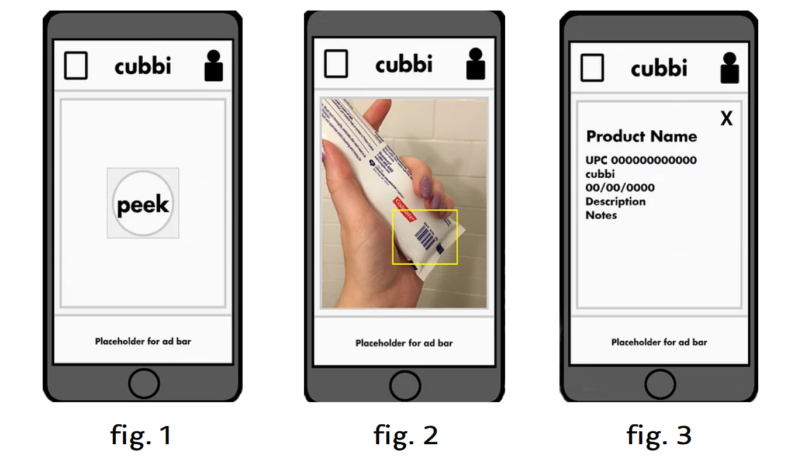

# Project: cubbi  
#### By Kathleen R McKiernan  

## Introduction  
With this project, cubbi is an HTML-based barcode scanning and organizing system. Through the use of three APIs, cubbi can open the user's camera to scan a barcode, check that barcode against a barcode collection, and then save it to the user's profile. This project was created through a passion for accessibility and a desire to refine technology to better suit the visually impaired community.  
 To learn more about cubbi, please follow this [link](https://kathleenrmck.medium.com/a-peek-into-cubbi-123444af92fc) and this [link](https://www.cubbi.info/download) to subscribe for updates on the app!  

## Installation  
Future versions will hopefully be hosted on the app store and this text block will be replaced with a link to download!  

## Usage  

Seen in the screenshots inserted above, fig. 1 is the main page users see when opening the app. They can navigate the header buttons or press the center "peek" button to confirm their desire to scan an item. Upon pressing the "peek" button, the user is brought to fig. 2 where the users camera is initialized and ready to capture a barcode. Once the user scans the barcode, they are taken to fig. 3 where the item's name and any saved information is displayed in a concise format for ease of use to the user.

## Contributing  
Kathleen R McKiernan | [Twitter](https://twitter.com/KathleenRMcK) | [Github](https://github.com/KathleenRMcK) | [Linkedin](https://www.linkedin.com/in/kathleen-mckiernan-665658103/)  

## Related Projects  
Affiliated repositories include: cubbi_v1  

## Licensing  
Usage provided by cubbi and its affiliated individuals  